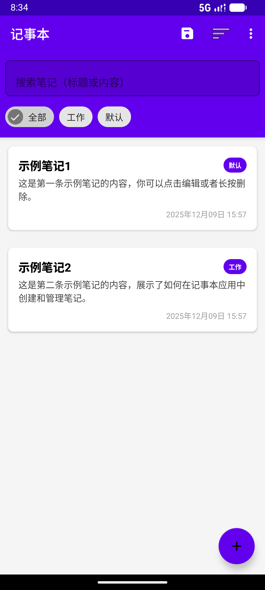
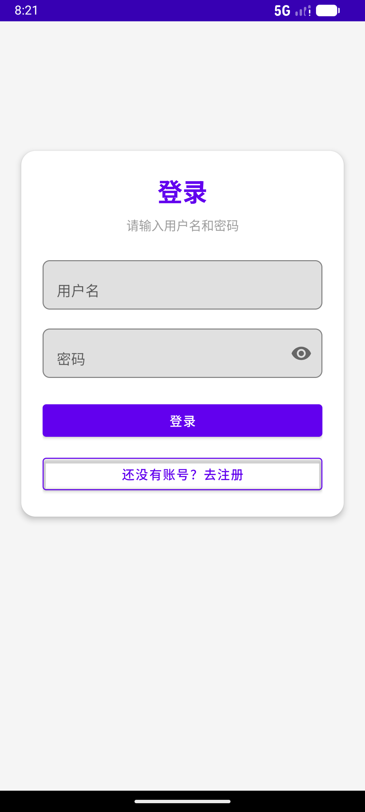
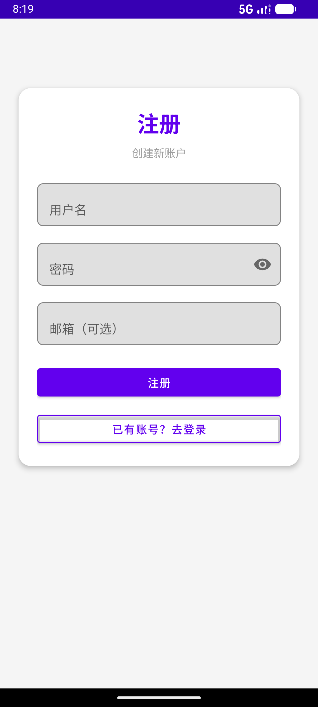
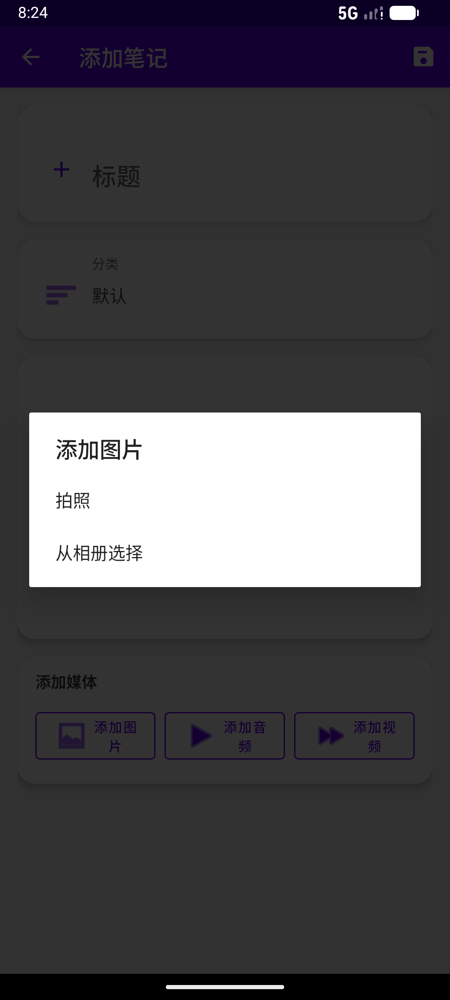
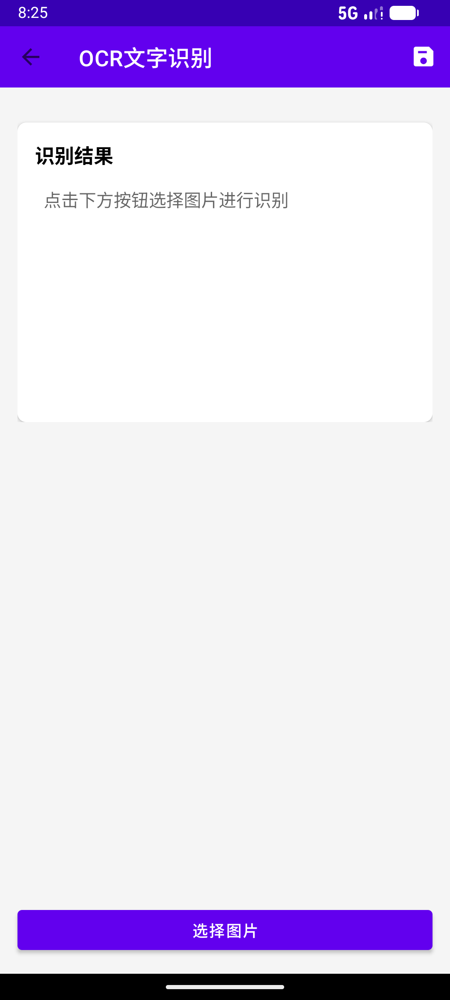
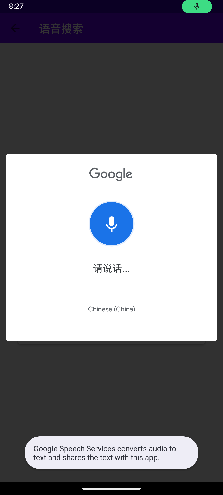
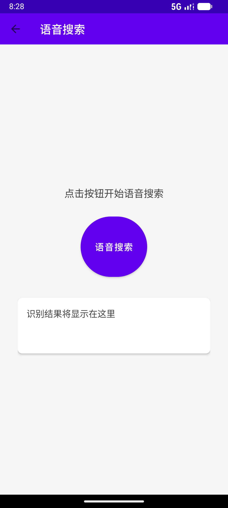
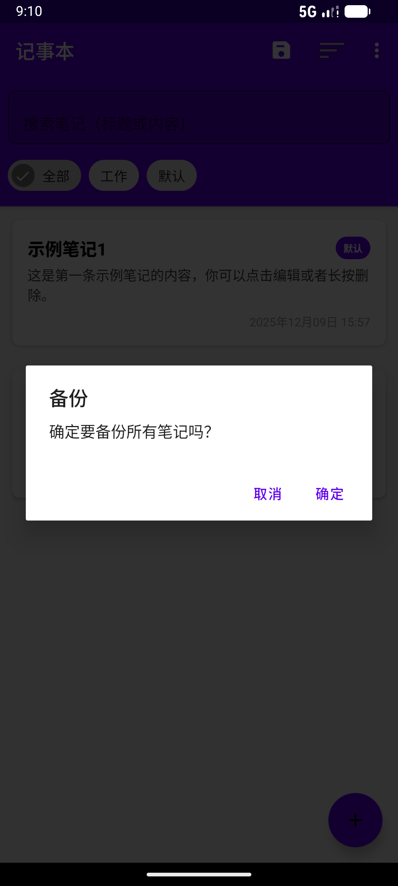

# SmartNote 记事本项目实验报告

## 一、项目设计思路

### 核心目标
本项目旨在开发一款功能全面、安全可靠的智能记事本应用，不仅满足用户基础的记事需求，更通过用户认证系统、多模态输入（OCR文字识别、语音搜索）和智能提醒等高级功能，提升用户体验与数据安全性。相较于传统记事本，本项目特别注重用户数据的隐私保护与个性化管理。

### 主要功能模块
- **用户认证模块**：实现安全的登录与注册功能，保障用户数据隔离与隐私。
- **核心记事模块**：笔记的创建、编辑、查看、删除、备份与恢复。
- **增强功能模块**：
    - OCR文字识别：从图片中提取文字并生成笔记
    - 语音搜索：通过语音输入快速搜索笔记
    - 智能提醒：为笔记设置时间提醒
    - 便签模式：快速创建桌面便签
- **数据与设置模块**：本地数据存储、用户偏好设置管理

### 用户需求分析
| 需求类型 | 具体描述 |
|---------|---------|
| 安全性需求 | 用户希望个人笔记数据得到保护，防止他人随意查看 |
| 便捷性需求 | 支持多种输入方式（键盘、图片、语音），快速记录灵感 |
| 管理性需求 | 能够对大量笔记进行有效搜索、分类和定时提醒 |
| 个性化需求 | 根据个人喜好调整应用界面与行为 |

### 技术选型与实现架构
- **数据存储**：
    - SharedPreferences：存储用户信息与轻量配置
    - SQLite数据库：通过`NoteStorage`与`UserStorage`类管理笔记和用户数据
- **用户认证**：独立设计`User`数据模型与`UserStorage`管理类
- **模块化开发**：每个核心功能对应独立的Activity（如OCRActivity、VoiceSearchActivity）
- **界面设计**：采用Android标准Material Design组件

---

## 二、项目功能实现

### 1. 用户登录与注册模块
**功能描述**：提供安全的账户系统，用户需注册并登录后才能使用记事本核心功能，确保笔记数据私人化。

**实现思路**：
- 设计`User`实体类（含用户名、加密密码等字段）
- 创建`UserStorage`类负责用户数据持久化
- `RegisterActivity`处理注册（检查用户名唯一性）
- `LoginActivity`处理登录验证

**核心代码**（UserStorage示例）：
java
// 保存用户列表
public static void saveUsers(Context context, List<User> users) {
FileOutputStream fos = null;
ObjectOutputStream oos = null;

    try {
        fos = context.openFileOutput(FILE_NAME, Context.MODE_PRIVATE);
        oos = new ObjectOutputStream(fos);
        oos.writeObject(users);
        Log.d(TAG, "Users saved successfully");
    } catch (IOException e) {
        Log.e(TAG, "Error saving users: " + e.getMessage());
    } finally {
        try {
            if (oos != null) {
                oos.close();
            }
            if (fos != null) {
                fos.close();
            }
        } catch (IOException e) {
            Log.e(TAG, "Error closing streams: " + e.getMessage());
        }
    }
}

// 加载用户列表
public static List<User> loadUsers(Context context) {
FileInputStream fis = null;
ObjectInputStream ois = null;
List<User> users = null;

    try {
        fis = context.openFileInput(FILE_NAME);
        ois = new ObjectInputStream(fis);
        users = (List<User>) ois.readObject();
        Log.d(TAG, "Users loaded successfully");
    } catch (IOException | ClassNotFoundException e) {
        Log.d(TAG, "No existing users file, creating new list");
        users = new ArrayList<>();
    } finally {
        try {
            if (ois != null) {
                ois.close();
            }
            if (fis != null) {
                fis.close();
            }
        } catch (IOException e) {
            Log.e(TAG, "Error closing streams: " + e.getMessage());
        }
    }
    
    return users != null ? users : new ArrayList<>();
}

// 注册新用户
public static boolean registerUser(Context context, String username, String password, String email) {
List<User> users = loadUsers(context);

    // 检查用户名是否已存在
    for (User user : users) {
        if (user.getUsername().equals(username)) {
            return false; // 用户名已存在
        }
    }
    
    // 添加新用户
    User newUser = new User(username, password, email);
    users.add(newUser);
    saveUsers(context, users);
    return true;
}
**效果展示**：  
用户首次启动进入注册界面 → 注册成功 → 登录 → 进入主界面（笔记数据绑定账户）
**截图展示**：

---

### 2. OCR文字识别功能
**功能描述**：允许用户拍摄或选择图片，提取文字生成新笔记。

**实现思路**：
- `OCRActivity`处理图片选择与拍摄
- 集成Google ML Kit Text Recognition API
- 识别结果传递至`EditNoteActivity`编辑保存

**核心代码**（OCRActivity识别流程）：
private void setupActivityResultLaunchers() {
cameraLauncher = registerForActivityResult(
new ActivityResultContracts.StartActivityForResult(),
result -> {
if (result.getResultCode() == RESULT_OK && imageUri != null) {
loadImageFromUri(imageUri);
}
}
);

    galleryLauncher = registerForActivityResult(
        new ActivityResultContracts.StartActivityForResult(),
        result -> {
            if (result.getResultCode() == RESULT_OK && result.getData() != null) {
                Uri uri = result.getData().getData();
                if (uri != null) {
                    loadImageFromUri(uri);
                }
            }
        }
    );

    permissionLauncher = registerForActivityResult(
        new ActivityResultContracts.RequestPermission(),
        isGranted -> {
            if (isGranted) {
                // 权限已授予，重新尝试操作
                if (isTakingPhoto) {
                    takePhoto();
                } else {
                    selectFromGallery();
                }
            } else {
                String message = isTakingPhoto ? 
                    getString(R.string.camera_permission_required) : 
                    getString(R.string.storage_permission_required);
                Toast.makeText(this, message, Toast.LENGTH_SHORT).show();
            }
        }
    );
}

private void showImageSourceDialog() {
String[] options = {getString(R.string.take_photo), getString(R.string.from_gallery)};
new AlertDialog.Builder(this)
.setTitle(getString(R.string.select_image))
.setItems(options, (dialog, which) -> {
if (which == 0) {
isTakingPhoto = true;
takePhoto();
} else {
isTakingPhoto = false;
selectFromGallery();
}
})
.show();
}

private void takePhoto() {
if (ContextCompat.checkSelfPermission(this, Manifest.permission.CAMERA)
!= PackageManager.PERMISSION_GRANTED) {
if (ActivityCompat.shouldShowRequestPermissionRationale(this, Manifest.permission.CAMERA)) {
new AlertDialog.Builder(this)
.setTitle("需要相机权限")
.setMessage("拍照功能需要相机权限")
.setPositiveButton("确定", (dialog, which) ->
permissionLauncher.launch(Manifest.permission.CAMERA))
.setNegativeButton("取消", null)
.show();
} else {
permissionLauncher.launch(Manifest.permission.CAMERA);
}
return;
}

    try {
        File photoFile = createImageFile();
        imageUri = FileProvider.getUriForFile(this,
                getApplicationContext().getPackageName() + ".fileprovider",
                photoFile);

        Intent intent = new Intent(MediaStore.ACTION_IMAGE_CAPTURE);
        intent.putExtra(MediaStore.EXTRA_OUTPUT, imageUri);
        intent.addFlags(Intent.FLAG_GRANT_READ_URI_PERMISSION);
        intent.addFlags(Intent.FLAG_GRANT_WRITE_URI_PERMISSION);
        cameraLauncher.launch(intent);
    } catch (IOException e) {
        Toast.makeText(this, "创建图片文件失败", Toast.LENGTH_SHORT).show();
    }
}

private void selectFromGallery() {
if (ContextCompat.checkSelfPermission(this, Manifest.permission.READ_EXTERNAL_STORAGE)
!= PackageManager.PERMISSION_GRANTED &&
ContextCompat.checkSelfPermission(this, Manifest.permission.READ_MEDIA_IMAGES)
!= PackageManager.PERMISSION_GRANTED) {
// Android 13+ 使用 READ_MEDIA_IMAGES
if (android.os.Build.VERSION.SDK_INT >= android.os.Build.VERSION_CODES.TIRAMISU) {
permissionLauncher.launch(Manifest.permission.READ_MEDIA_IMAGES);
} else {
permissionLauncher.launch(Manifest.permission.READ_EXTERNAL_STORAGE);
}
return;
}

    Intent intent = new Intent(Intent.ACTION_PICK, MediaStore.Images.Media.EXTERNAL_CONTENT_URI);
    galleryLauncher.launch(intent);
}
**效果展示**：  
拍照/相册导入图片 → 自动提取文字 → 生成可编辑笔记草稿

**截图展示**：

---

### 3. 语音搜索功能
**功能描述**：通过语音输入关键词快速搜索笔记。

**实现思路**：
- `VoiceSearchActivity`集成SpeechRecognizer API
- 语音转文本作为搜索关键词
- 调用`NoteStorage`搜索方法过滤结果

**核心代码**（语音识别监听）：
java
private void initSpeechRecognizer() {
// 首先尝试使用SpeechRecognizer API（需要Google服务）
// 但即使不可用，也不退出，而是使用Intent方式
if (SpeechRecognizer.isRecognitionAvailable(this)) {
try {
speechRecognizer = SpeechRecognizer.createSpeechRecognizer(this);
if (speechRecognizer == null) {
// 创建失败，使用Intent方式
return;
}
speechRecognizer.setRecognitionListener(new RecognitionListener() {
@Override
public void onReadyForSpeech(Bundle params) {
tvStatus.setText(getString(R.string.speaking));
isListening = true;
btnStart.setText("停止");
}

                @Override
                public void onBeginningOfSpeech() {}

                @Override
                public void onRmsChanged(float rmsdB) {}

                @Override
                public void onBufferReceived(byte[] buffer) {}

                @Override
                public void onEndOfSpeech() {
                    isListening = false;
                    btnStart.setText(getString(R.string.voice_search));
                }

                @Override
                public void onError(int error) {
                    isListening = false;
                    btnStart.setText(getString(R.string.voice_search));
                    String errorMessage = "识别错误";
                    switch (error) {
                        case SpeechRecognizer.ERROR_AUDIO:
                            errorMessage = "音频错误";
                            break;
                        case SpeechRecognizer.ERROR_CLIENT:
                            errorMessage = "客户端错误";
                            break;
                        case SpeechRecognizer.ERROR_INSUFFICIENT_PERMISSIONS:
                            errorMessage = "权限不足";
                            break;
                        case SpeechRecognizer.ERROR_NETWORK:
                            errorMessage = "网络错误";
                            break;
                        case SpeechRecognizer.ERROR_NETWORK_TIMEOUT:
                            errorMessage = "网络超时";
                            break;
                        case SpeechRecognizer.ERROR_NO_MATCH:
                            errorMessage = "未识别到内容";
                            break;
                        case SpeechRecognizer.ERROR_RECOGNIZER_BUSY:
                            errorMessage = "识别器忙碌";
                            break;
                        case SpeechRecognizer.ERROR_SERVER:
                            errorMessage = "服务器错误";
                            break;
                        case SpeechRecognizer.ERROR_SPEECH_TIMEOUT:
                            errorMessage = "说话超时";
                            break;
                    }
                    tvStatus.setText(errorMessage);
                    Toast.makeText(VoiceSearchActivity.this, errorMessage, Toast.LENGTH_SHORT).show();
                }

                @Override
                public void onResults(Bundle results) {
                    ArrayList<String> matches = results.getStringArrayList(SpeechRecognizer.RESULTS_RECOGNITION);
                    if (matches != null && !matches.isEmpty()) {
                        String result = matches.get(0);
                        tvResult.setText(result);
                        tvStatus.setText("识别完成");
                        
                        // 自动执行搜索
                        performSearch(result);
                    }
                    isListening = false;
                    btnStart.setText(getString(R.string.voice_search));
                }

                @Override
                public void onPartialResults(Bundle partialResults) {
                    ArrayList<String> matches = partialResults.getStringArrayList(SpeechRecognizer.RESULTS_RECOGNITION);
                    if (matches != null && !matches.isEmpty()) {
                        tvResult.setText(matches.get(0));
                    }
                }
**效果展示**：  
点击麦克风 → 说出关键词 → 实时显示匹配笔记列表

**截图展示**：

---

### 4. 智能提醒与便签功能
**功能描述**：
- **提醒功能**：设置笔记提醒时间，通过通知栏提醒
- **便签功能**：快速创建桌面便签（支持置顶）

**实现思路**：
- `ReminderManager`：管理提醒创建/存储/触发
- `ReminderReceiver`：继承BroadcastReceiver接收闹钟事件
- `StickyNoteActivity`：提供简约编辑界面

**核心代码**（ReminderManager设置提醒）：
java
public class ReminderManager {
private static final String ACTION_REMINDER = "com.example.notepad.REMINDER";

    public static void setReminder(Context context, Note note) {
        if (note.getReminderDate() == null || note.getReminderDate().before(new Date())) {
            return;
        }
        
        AlarmManager alarmManager = (AlarmManager) context.getSystemService(Context.ALARM_SERVICE);
        Intent intent = new Intent(context, ReminderReceiver.class);
        intent.putExtra("note_title", note.getTitle());
        intent.putExtra("note_content", note.getContent());
        intent.putExtra("note_id", note.hashCode());
        
        PendingIntent pendingIntent = PendingIntent.getBroadcast(
            context, 
            note.hashCode(), 
            intent, 
            PendingIntent.FLAG_UPDATE_CURRENT | PendingIntent.FLAG_IMMUTABLE
        );
        
        alarmManager.setExact(AlarmManager.RTC_WAKEUP, note.getReminderDate().getTime(), pendingIntent);
    }
    
    public static void cancelReminder(Context context, Note note) {
        AlarmManager alarmManager = (AlarmManager) context.getSystemService(Context.ALARM_SERVICE);
        Intent intent = new Intent(context, ReminderReceiver.class);
        PendingIntent pendingIntent = PendingIntent.getBroadcast(
            context, 
            note.hashCode(), 
            intent, 
            PendingIntent.FLAG_UPDATE_CURRENT | PendingIntent.FLAG_IMMUTABLE
        );
        alarmManager.cancel(pendingIntent);
    }
    
    public static void updateAllReminders(Context context, List<Note> notes) {
        for (Note note : notes) {
            if (note.isTodo() && note.getReminderDate() != null) {
                setReminder(context, note);
            }
        }
    }
}
**效果展示**：  
编辑界面设提醒 → 到达时间推送通知｜便签界面快速输入保存

**截图展示**：

---

### 5. 数据备份与恢复
**功能描述**：导出笔记为JSON备份文件，支持导入恢复。

**实现思路**：
- `BackupManager`类序列化Note列表为JSON
- 保存至外部存储
- 恢复时解析JSON批量插入数据库

**效果展示**：  
设置界面点击"备份/恢复" → 操作后显示提示
**截图展示**：

---

## 三、关键技术细节
1. **数据分层存储**：
    - 用户数据 → SharedPreferences
    - 笔记数据 → SQLite数据库（NoteStorage封装CRUD）
2. **模块间通信**：
    - Intent传递数据（OCR结果/搜索关键词）
    - BroadcastReceiver处理系统事件（提醒触发）
3. **权限管理**：动态请求摄像头/录音/存储权限
4. **UI适配**：
    - RecyclerView + NotesAdapter实现高效列表
    - 多Activity独立设计保证响应速度

---

## 四、项目亮点与扩展方向

### 1. 项目亮点
- ✅ 完整用户系统（数据隔离+隐私保护）
- ✅ 多模态输入/搜索（文本+图片+语音）
- ✅ 模块化架构（功能独立Activity）
- ✅ 实用功能全覆盖（记事/提醒/备份/便签）

### 2. 后续优化方向
- ☁️ **云端同步**：集成Firebase实现跨设备同步
- 🏷️ **分类标签**：增加笔记分类/标签系统
- 🎨 **主题自定义**：支持深色模式/多主题
- 🔒 **笔记加密**：单篇/全文密码/指纹加密
- 👥 **协作分享**：支持链接分享与权限控制

---

## 五、总结
本项目成功实现了功能全面、安全可靠的智能记事本应用：
- 通过用户认证保障数据隐私
- 通过OCR/语音搜索/智能提醒提升体验
- 模块化架构确保可维护性
- 具备良好扩展性（云端同步/分类标签等）

未来可通过云端同步、主题定制等功能进一步满足用户需求。